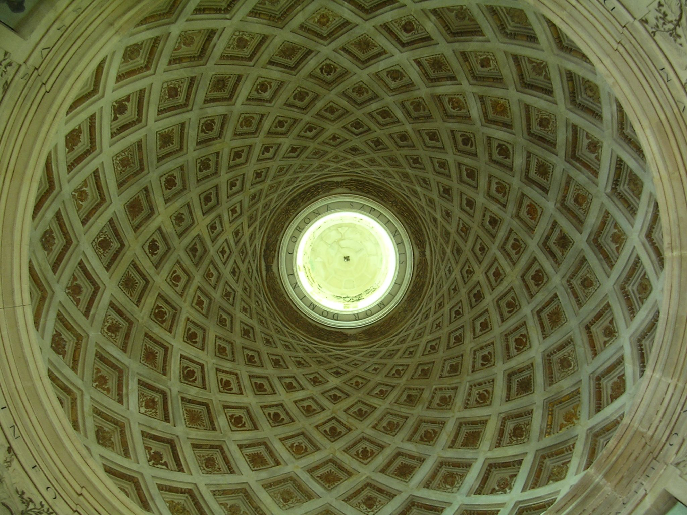
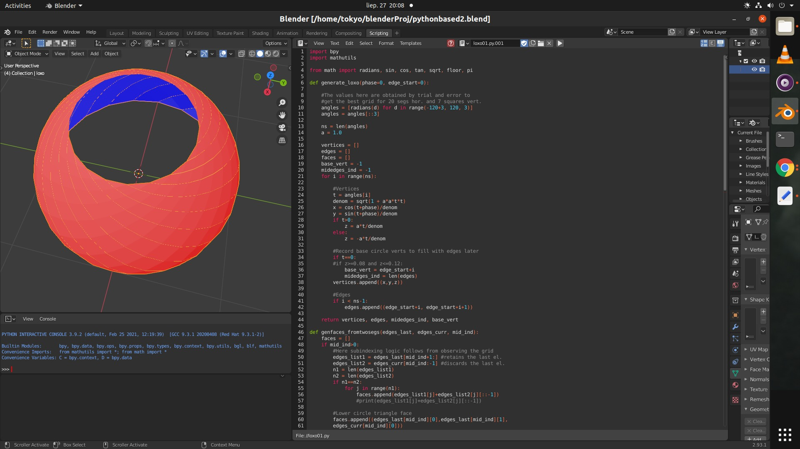
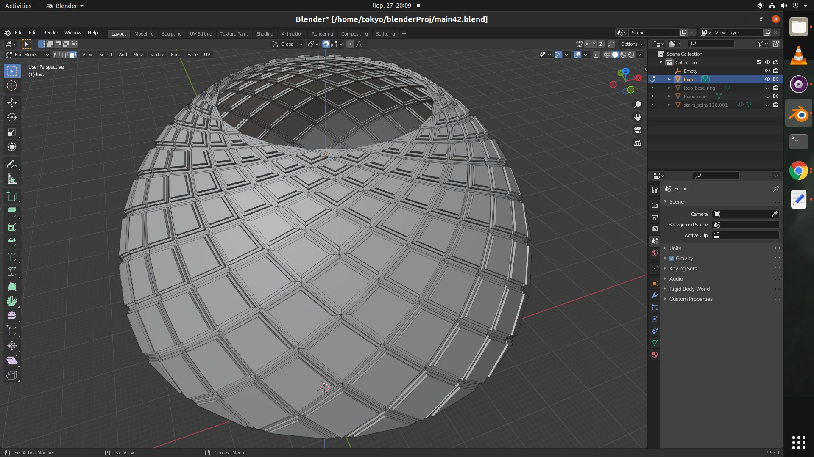
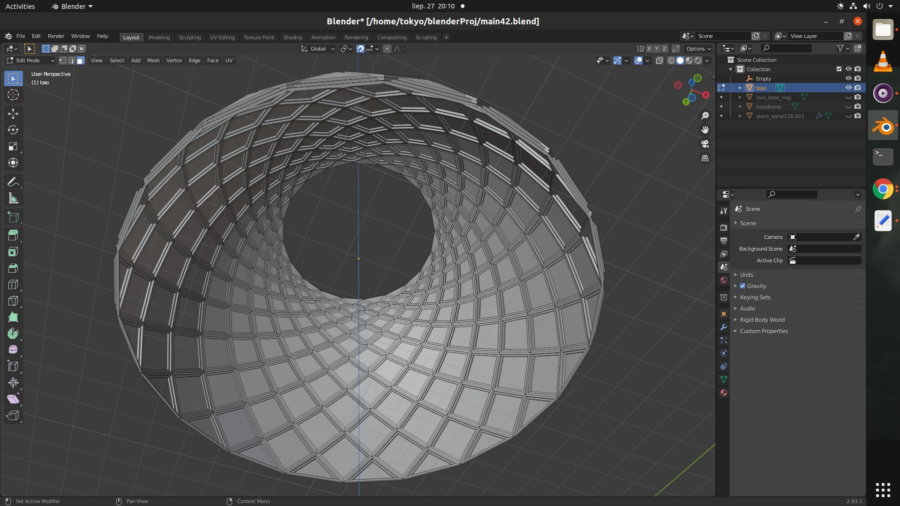
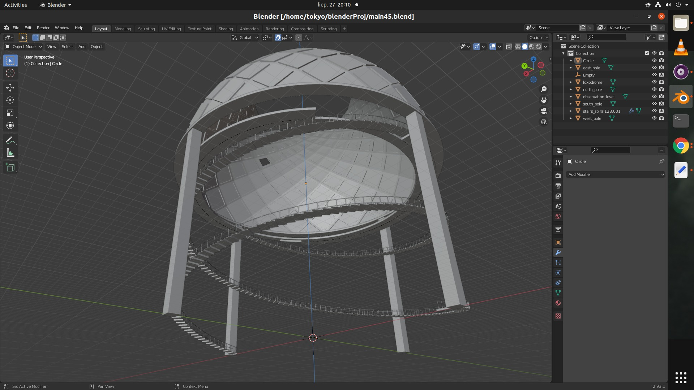

## Château d'Anet

Concerning the French Renaissance architecture, an interesting case to marvel at is Château d'Anet and its dome (cupola), which I reproduce from [the Wikipedia article](https://fr.wikipedia.org/wiki/Ch%C3%A2teau_d%27Anet) here:

<table>
<tr>
<th style="text-align:center"> Coupole de la chapelle, Château d'Anet</th>
</tr>
<tr>
<td>

</td>
</tr>
</table>

What are these line patterns, how to draw them?

## Loxodromes

One could work by selecting loops on the sphere in the edit mode and rotating them with the proportional editing turned on, and then mirroring them to double the amount of lines in order to get something that resembles an orthogonal grid of similar square patches shown above. 

However, it is difficult to get this right, the lines do not form similar square patches as the areas decrease when the parallels approach the poles, and those sensitive denser areas closer to the poles do not resemble the original design.

Most likely these lines are the instances of a loxodrome, i.e. "the path taken when a compass is kept pointing in a constant direction"](https://mathworld.wolfram.com/Loxodrome.html). Apparently, their [parametric equations](https://mathworld.wolfram.com/SphericalSpiral.html) have been very well known to the main architect of Henry II of France, Philibert de l'Orme. 

I would note that this is the 16th century, the chateau was build 20 years before [St. Bartholomew's Day massacre](https://en.wikipedia.org/wiki/St._Bartholomew%27s_Day_massacre) which are the events shown in [La Reine Margot (1994)](https://www.imdb.com/title/tt0110963/). A subsequent Henry III of France was also [the king of Poland and Grand Duke of Lithuania from 1573 to 1575](https://en.wikipedia.org/wiki/Henry_III_of_France), but he ran away from us ;).

Below you can see my results of encoding such spherical spirals with Blender's facility to create geometry with Python scripts. Feel free to use them if your project involves the need for such a dome.

## Some Results

Install Blender (it is as simple as [sudo snap install blender --classic](https://linuxconfig.org/how-to-install-blender-on-ubuntu-20-04-focal-fossa-linux-desktop)
on Ubuntu 20.04), and then play with these Blender files. I provide some images below just in case.

<table>
<tr>
<th style="text-align:center"> Cupola modeled in Blender with Python scripting</th>
</tr>
<tr>
<td>

</td>
</tr>
</table>

<table>
<tr>
<th style="text-align:center"> Cupola's exterior, the result of extruding and insetting</th>
</tr>
<tr>
<td>

</td>
</tr>
</table>

<table>
<tr>
<th style="text-align:center"> Cupola's interior in Blender</th>
</tr>
<tr>
<td>

</td>
</tr>
</table>

<table>
<tr>
<th style="text-align:center"> Observation tower made with Blender</th>
</tr>
<tr>
<td>

</td>
</tr>
</table>

The last image shows my virtual observatory which utilizes the cupola. It remains under construction. There are no textures and the telescope is still missing there ;).

## Acknowledgments

My friend from the Finnish years, a professional architect, Leo Michael, explained me some of the advancements that took place after the Roman architectural revolution, this got me hooked on architecture as a small hobby.

A few good Blender tutorials:

[Blender 2.8 | Easy stairs tutorial by EMU Enoksi](https://www.youtube.com/watch?v=UZbVC9imtIg)

[Learn Low Poly Modeling in Blender 2.9 / 2.8, Imphenzia](https://www.youtube.com/watch?v=1jHUY3qoBu8)

[Blender 2.8 The complete guide from beginner to pro, by Julien Deville](https://www.udemy.com/course/blender-28-the-complete-guide-from-beginner-to-pro/)
